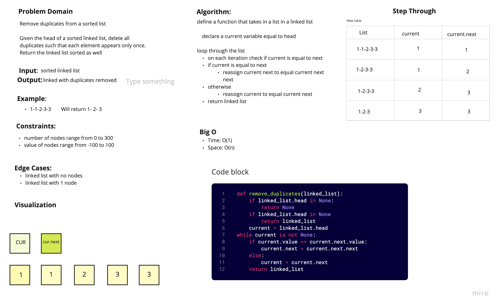

# Remove Duplicates from a Linked List
<!-- Short summary or background information -->

## Challenge
<!-- Description of the challenge -->

## Approach & Efficiency
<!-- What approach did you take? Why? What is the Big O space/time for this approach? -->
Since the list is sorted, we only need to check the current and next variable to see if they're equal. If they are, just reassign the next pointer to whatever is in front of the duplicate

Big O:

Time: O(n)
Space: O(1)

