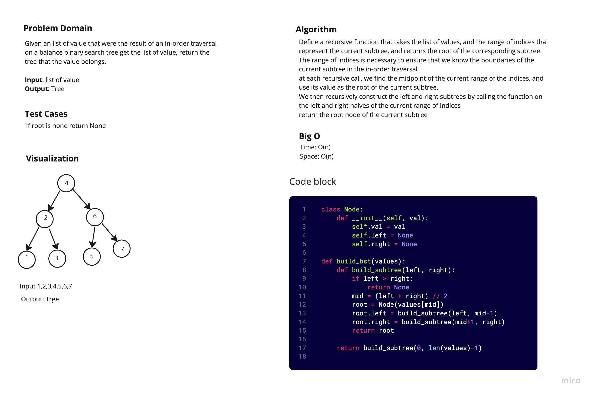

# Balance Tree

Given an list of value that were the result of an in-order traversal on a balance binary search tree get the list of value, return the tree that the value belongs.

## White Board Process

## Approach and Efficiency

I recursively traverse each node along the leaf to find the balance tree that will return True.

Big O:

- Space: O(n)
- Time: O(n)
