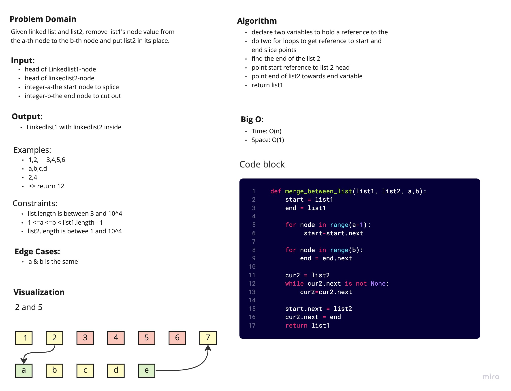

# Graphs
<!-- Short summary or background information -->
Given two linked list, and an "a" and "b" integer value, remove the nodes in linked list 1 from "a" to "b" and insert linked list 2.

## Challenge
<!-- Description of the challenge -->

## Approach & Efficiency
<!-- What approach did you take? Why? What is the Big O space/time for this approach? -->

## API
<!-- Description of each method publicly available in your Graph -->
