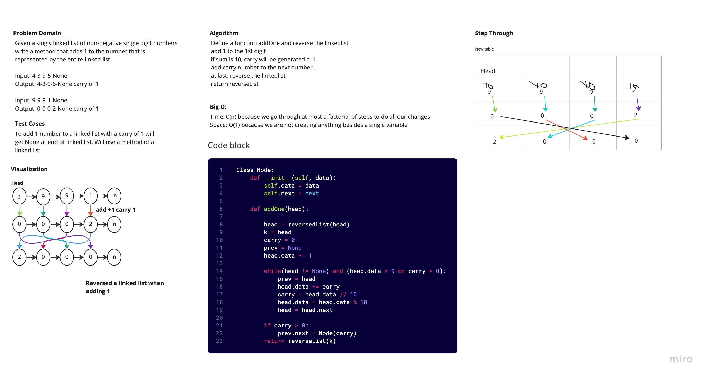

# Odometer Linked List

Write a method for the circular linked list class: its head attribute that is pointing to its node.

## White Board Process

## Approach and Efficiency

I recursively traverse each node along the linked list that will return True.

Big O:

- Space: O(h)
- Time: O(n)
