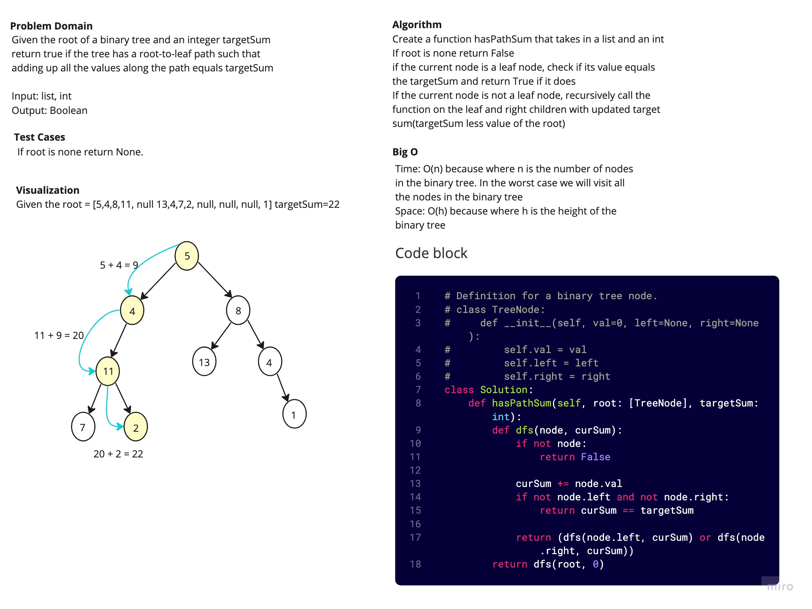

# Path Sum

Given the root of a binary tree and an integer targetSum, return true if the tree has a root-to-leaf path such that adding up all the values along the path equals targetSum.

## White Board Process

## Approach and Efficiency

I recursively traverse each node along the leaf to find the targetSum that will return True.

Big O:

- Space: O(h)
- Time: O(n)
