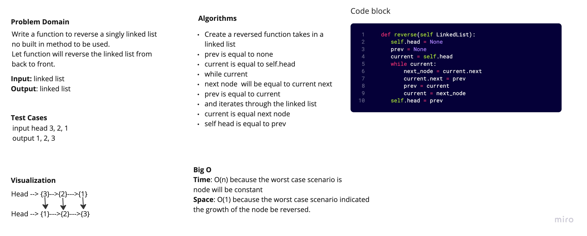

# Reverse A Singly List

Given a Singly Linked list, return the same list reversed.

## White Board Process

## Approach and Efficiency

I utilized 3 variables for reference as I traversed the list. A previous, current, and nextUp. On each traversal, I would point the current node to the previous. And then reassign all variables to be their respective next node.

Big O:

- Space: O(1)
- Time: O(n)
