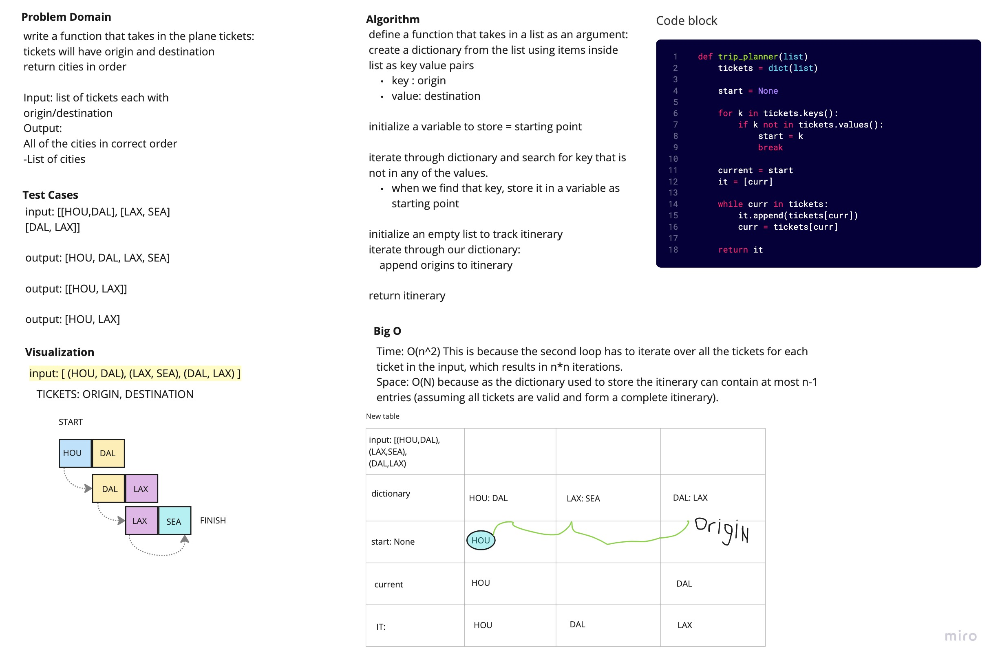

# Trip Planner

Write a function that takes in the plane tickets: tickets will have origin and destination return cities in order.

## White Board Process

## Approach and Efficiency

To use this function, I create a list of tuples containing the origin and destination cities for each ticket, and pass it to the function as an argument

Big O:

- Space: O(n)
- Time: O(n^2)
