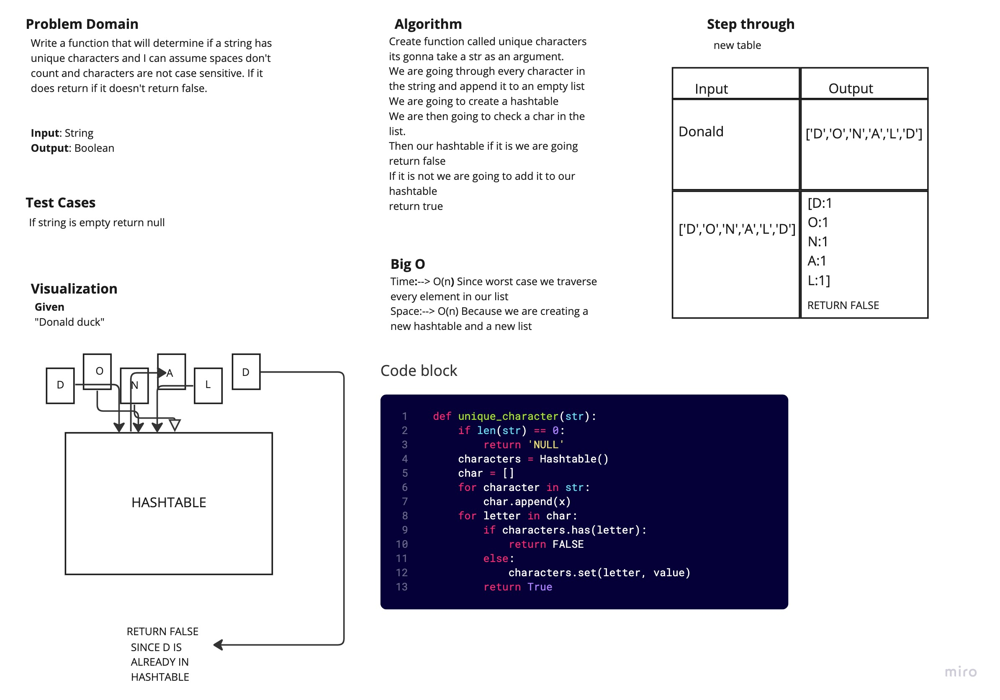

# Unique Character

Given a Unique character, return false if character are not case sensitive.

## White Board Process

## Approach and Efficiency

I found the unique character in the list without space and used the Hashtable to implement my data structure.

Big O:

- Space: O(nun)
- Time: O(1)
