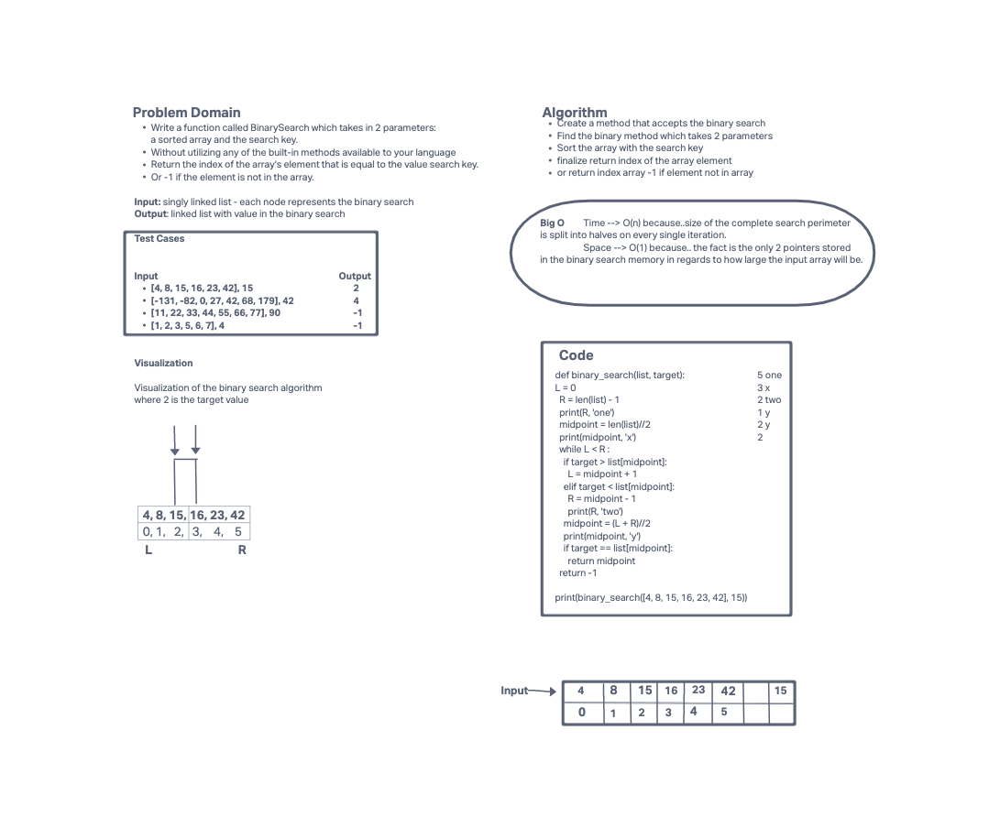

# Binary Search of Sorted Array
Write a function called BinarySearch which takes in 2 parameters: a sorted array and the search key.

## Whiteboard Process

## Approach & Efficiency
I used replit to find the appropriate approach on the sorted binary search solutions.

Big O

- Time: O(n) The size of the complete search perimeter is split into halves on every single iteration.
- Space: O(1) The fact is the only 2 pointers stored in the binary search memory in regards how large the input array will be.
