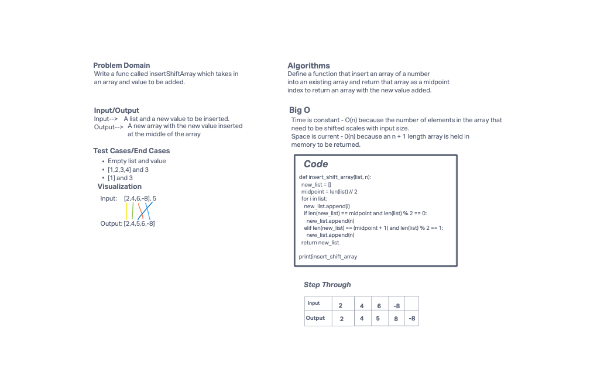

# Insert to Middle of an Array
<!-- Description of the challenge -->
This code challenge is called insertShiftArray
## Whiteboard Process
<!-- Embedded whiteboard image -->

## Approach & Efficiency
<!-- What approach did you take? Discuss Why. What is the Big O space/time for this approach? -->
I used replit is assist me with rendering my code accordingly for optimal approach of returning an array with the new value added at the middle index.

Big O

- Time: O(n) because the number of the element in the array that need to be shifted scales with input size.
- Space: O(n) because an N + 1 length array is held in memory to be returned.
