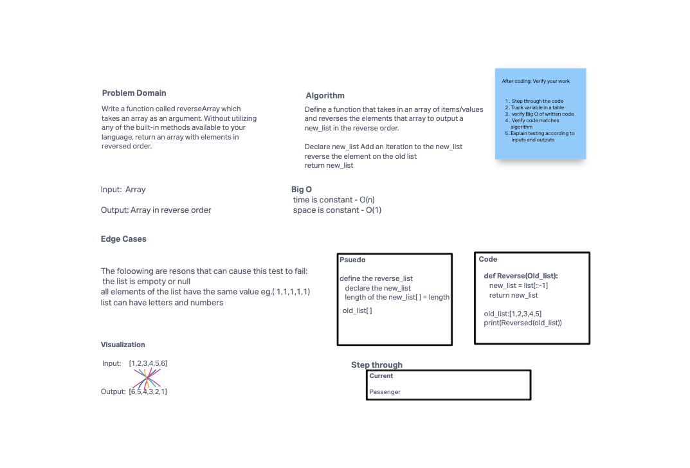

# Reverse an Array
<!-- Description of the challenge -->
This code challenge is based of the Reverse Array
## Whiteboard Process
<!-- Embedded whiteboard image -->

## Approach & Efficiency
<!-- What approach did you take? Discuss Why. What is the Big O space/time for this approach? -->
I used replit to as a conduit to render my code and implement my code into my whiteboard.
My Big O approach to Time--> O(n) because each element of input array must be visited to arrive at the solution.
My Big O approach to space --> O(n) because an array the same size as the input must be held in memory.
