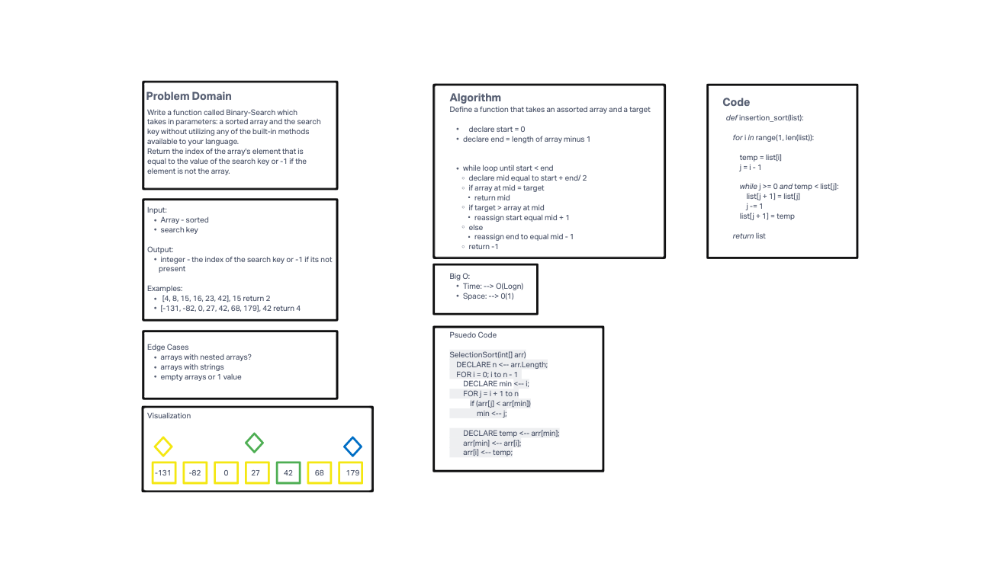

# Challenge Summary
<!-- Description of the challenge -->
Write a function called BinarySearch which takes in 2 parameters: a sorted array and the search key. Without utilizing any of the built-in methods available to your language, return the index of the array’s element that is equal to the value of the search key, or -1 if the element is not in the array. NOTE: The search algorithm used in your function should be a binary search.
## Whiteboard Process
<!-- Embedded whiteboard image -->

## Approach & Efficiency
<!-- What approach did you take? Why? What is the Big O space/time for this approach? -->
I begin by comparing an element in the middle of the array with the target value. If the target value matches the element, its position in the array is returned. If the target value is less than the element, the search continues in the lower half of the array. If the target value is greater than the element, the search continues in the upper half of the array. By doing this, the algorithm eliminates the half in which the target value cannot lie in each iteration. The time big O: O(log(n)). it's not linear, because over time the operation gets faster because each successive step the length of array that you need to search is cut in half. Space big O: O(1) because we're not writing or storing any significant amount of data other than the variables (L, R, midpoint) and those don't increase as the size of our input increases.

