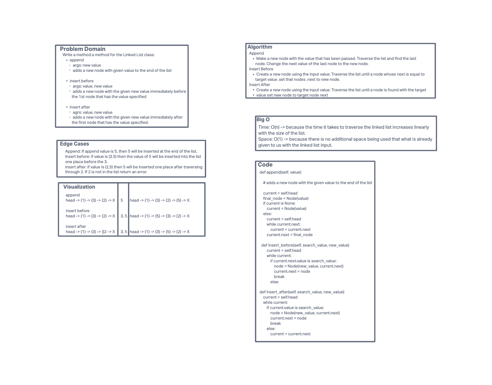

# Challenge Summary
<!-- Description of the challenge -->
Write the following methods for the Linked List class:

- append arguments: new value adds a new node with the given value to the end of the list
- insert before arguments: value, new value adds a new node with the given new value immediately before the first node
  that has the value specified
- insert after arguments: value, new value adds a new node with the given new value immediately after the first node that
   has the value specified
## Whiteboard Process
<!-- Embedded whiteboard image -->

## Approach & Efficiency
<!-- What approach did you take? Why? What is the Big O space/time for this approach? -->
append, insert_before, and insert_after methods:

- Time Big O: O(n): The time it takes to traverse the linked list increases linearly with the size of the list.
- Space big O: O(1): The script is making only one object and appending it to a linked list that already exists, so no matter
the input, this takes the same amount of memory.
