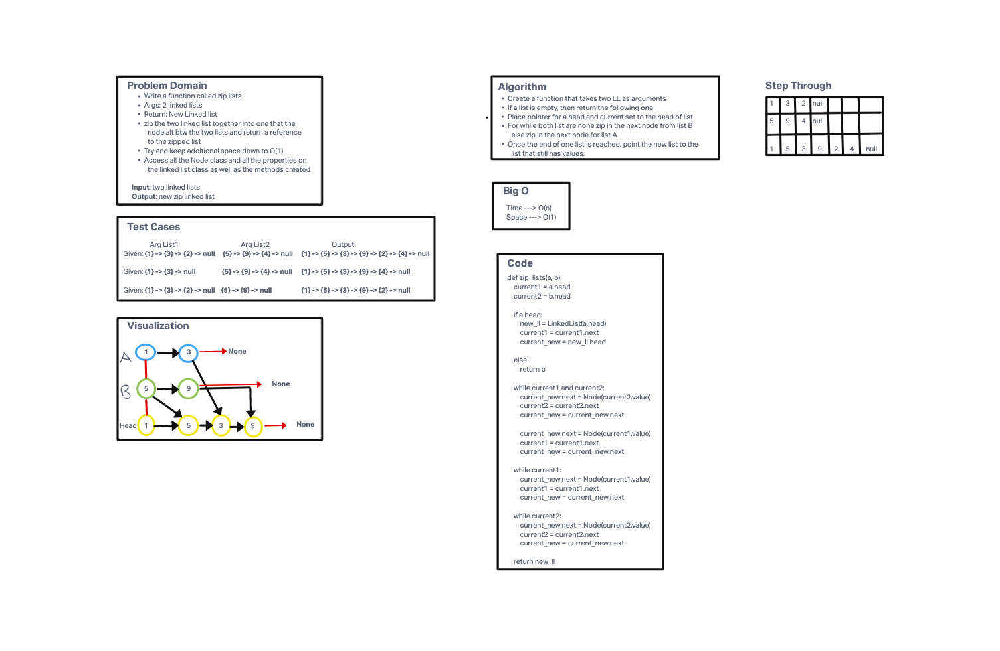

# Challenge Summary
<!-- Description of the challenge -->
- Write a function called zip lists
- Arguments: 2 linked lists
- Return: New Linked List, zipped as noted below
- Zip the two linked lists together into one so that the nodes alternate between the two lists and return a reference to
the the zipped list.
- Try and keep additional space down to O(1) You have access to the Node class and all the properties on the Linked List
class as well as the methods created in previous challenges.

## Whiteboard Process
<!-- Embedded whiteboard image -->

## Approach & Efficiency
<!-- What approach did you take? Why? What is the Big O space/time for this approach? -->
Created a pointer for each current of each of our two linked lists. I then created a new linked list and set its head to
be the head of our first linked list. I then set current of our first linked list to be its next node value. I then set
a while loop to alternatively each linked list while appending to our new linked list.

