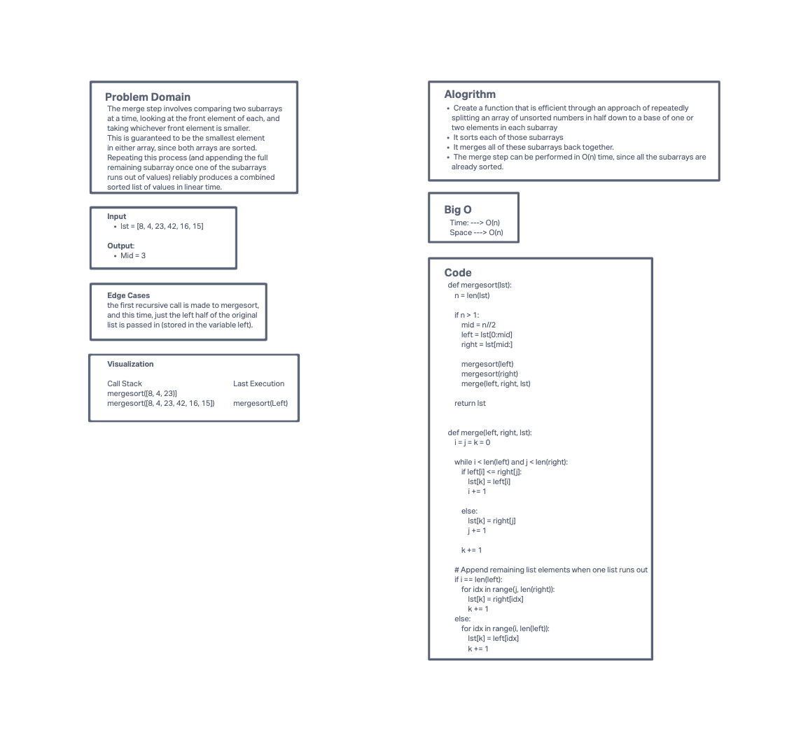

# Challenge Summary
<!-- Description of the challenge -->
Merge sort is an efficient sorting algorithm with a time complexity of O(nlogn). It achieves this efficiency through a “divide and conquer” approach of repeatedly splitting an array of unsorted numbers in half (usually recursively) down to a base case of one or two elements in each subarray. It sorts each of those subarrays. Finally, it merges all of these subarrays back together. The merge step can be performed in O(n) time, since all the subarrays are already sorted.

The merge step involves comparing two subarrays at a time, looking at the front element of each, and taking whichever front element is smaller. This is guaranteed to be the smallest element in either array, since both arrays are sorted. Repeating this process (and appending the full remaining subarray once one of the subarrays runs out of values) reliably produces a combined sorted list of values in linear time.

## Whiteboard Process
<!-- Embedded whiteboard image -->

## Approach & Efficiency
<!-- What approach did you take? Why? What is the Big O space/time for this approach? -->
Multiple merge steps of multiple subarrays yield a fully sorted array. Here is the code in Python (note that arrays in Python are called lists, so here the variable lst is used to represent the input array/list): Hey men!
## Solution
<!-- Show how to run your code, and examples of it in action -->
