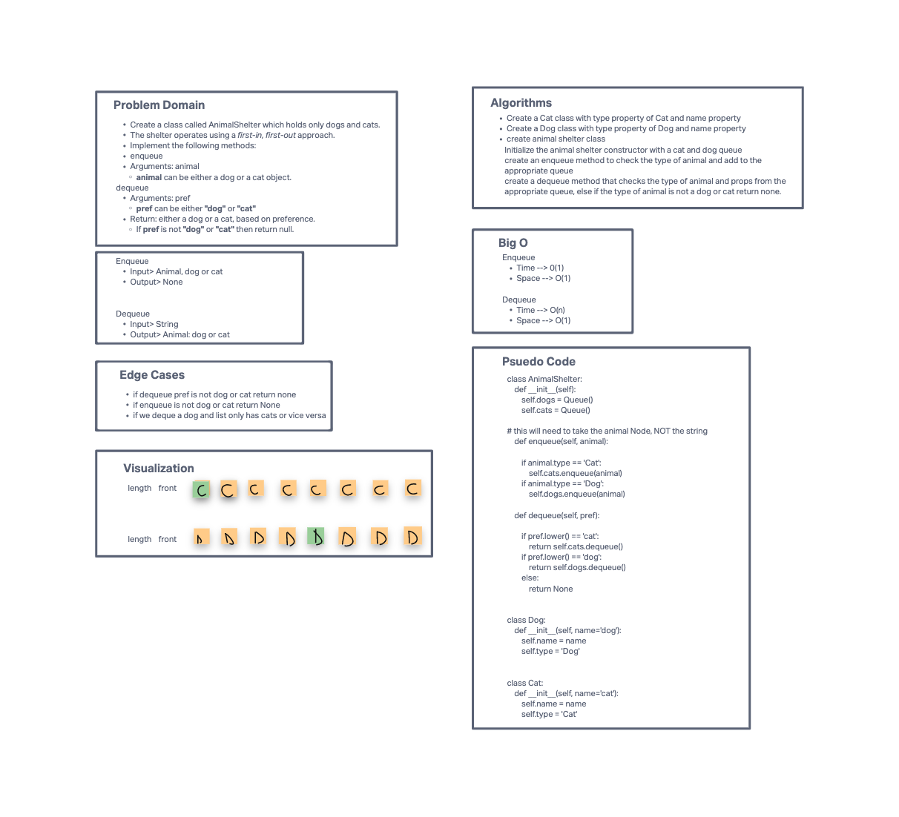

# Challenge Summary
<!-- Description of the challenge -->
Create a class called animal shelters which holds only dogs and cats. The shelter operates on a first in first out approach like a queue. Implement the following methods in the animal shelter class:

Enqueue

- takes an animal argument - can either be dog or cat object
- adds to the end of the queue

Dequeue

- takes a pref argument - can either be "dog" or "cat"
- returns either a dog or cat based on preference
- if first animal is not the preference, keep searching for the animal until you find it and then put all animals back in the same order

## Whiteboard Process
<!-- Embedded whiteboard image -->

## Approach & Efficiency
<!-- What approach did you take? Why? What is the Big O space/time for this approach? -->
In this Animal Shelter class I had to implement a length property to keep count of the queue length. Enqueue method is straightforward. Just add to the end. Dequeue method utilizes a rotation count variable that is initially equal to the queue length. If the first animal is not what we're looking for, we dequeue that animal and bring it to the end. We'll also decrement our rotation_count. If we do find the animal, well pull that out of the queue and then fix our queue order. To do this, we pull from the front and bring that animal to the rear of the queue "rotation count" amount of times. And that will put everything back in place. Then return the dequed item.

