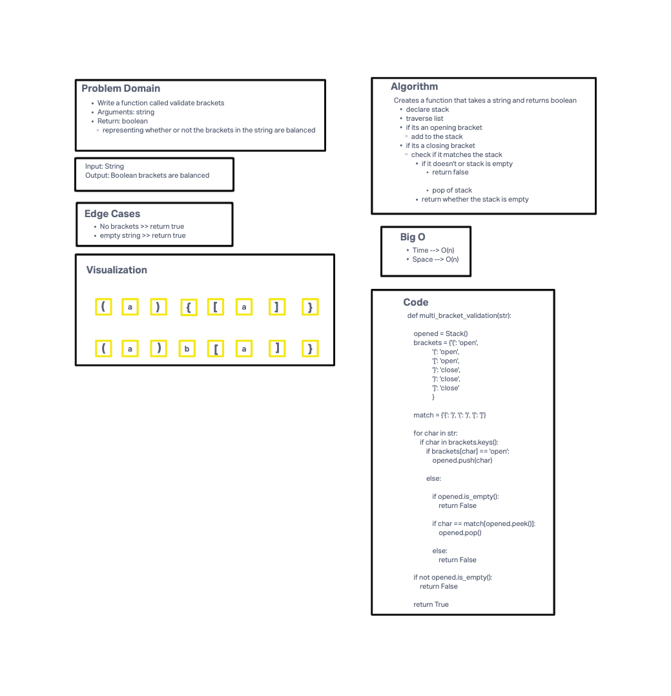

# Challenge Summary
<!-- Description of the challenge -->
Write a function called validate brackets

Arguments: string

Return: boolean representing whether or not the brackets in the string are balanced

There are 3 types of brackets:

- Round Brackets : ()

- Square Brackets : []

- Curly Brackets : {}

## Whiteboard Process
<!-- Embedded whiteboard image -->

## Approach & Efficiency
<!-- What approach did you take? Why? What is the Big O space/time for this approach? -->
I utilized a stack, a dictionary with opening and closing brackets as keys and open as value for opening brackets and close as value for closing brackets and a dictionary with matching pairs brackets as key and value I looped through the string, and checked every element. If the element is an opening bracket, I add to the stack. If the element is a closing bracket, I check if the stacks is not empty and it matches what's on top of the stack. If either of those conditions are false, I return false. Other-wise I pop off the stack and move on. At the end I return whether the stack is empty.

