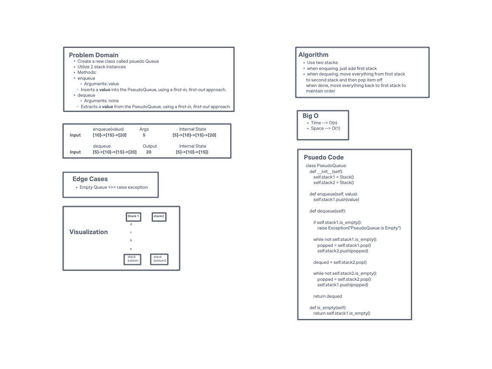

# Challenge Summary
<!-- Description of the challenge -->
Implement a Queue class using two stacks

## Whiteboard Process
<!-- Embedded whiteboard image -->

## Approach & Efficiency
<!-- What approach did you take? Why? What is the Big O space/time for this approach? -->
We used two stacks. All items get pushed and stored on the first stack. Whenever a dequeu needs to happen, we move everything from the first stack to the second and then pop off. Then to keep the correct order, we pop everything back into the first stack.
## Collaborator
<!-- Show how to run your code, and examples of it in action -->
Eric Kinuthia
