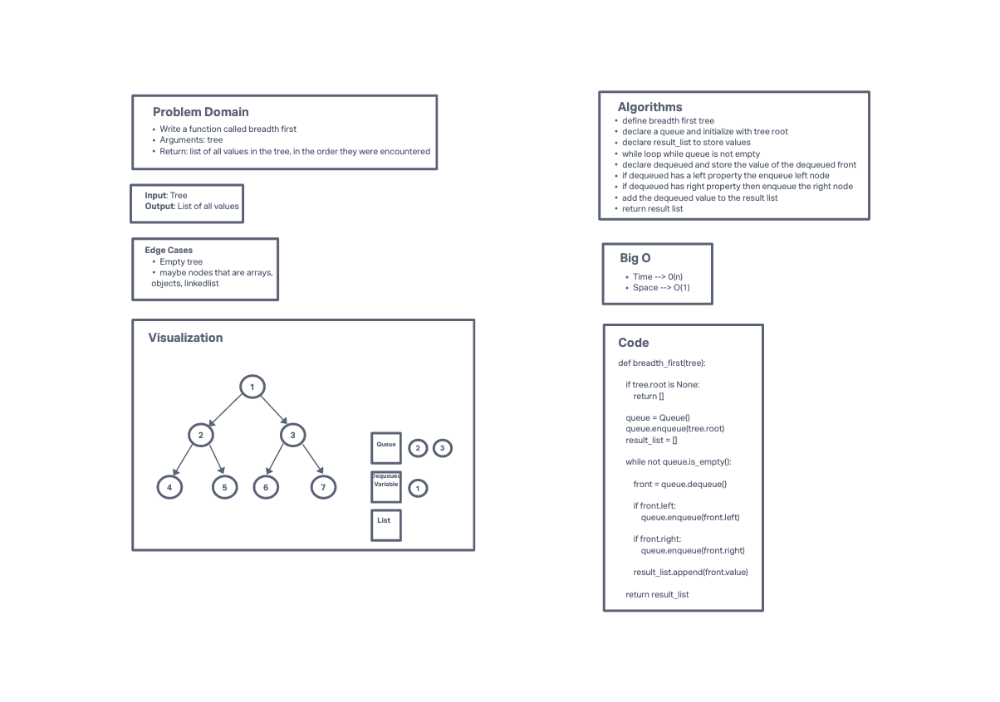

# Challenge Summary
<!-- Description of the challenge -->
Given a tree, return a list with a breadth first order.

## Whiteboard Process
<!-- Embedded whiteboard image -->

## Approach & Efficiency
<!-- What approach did you take? Why? What is the Big O space/time for this approach? -->
Breadth first traversal uses a queue to keep track of the nodes. We initialize our queue with the root of the tree. Then start a while loop while the queue is not empty. We will dequeue, then enqueue that dequeued items left and right property. Then push the value into a result list. Then return that result list.
## Collaborators
Got assistance from TA's Raven and Tammy
