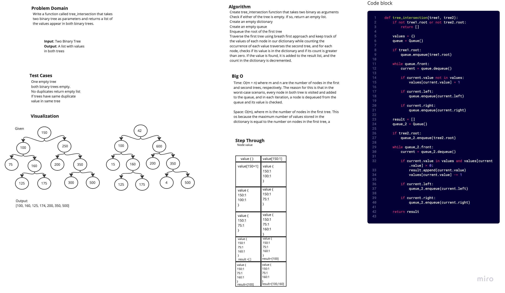

# Challenge Summary
<!-- Description of the challenge -->
Write a function called tree_intersection that takes two binary trees as parameters and returns a list of the values appear in both binary trees.
## Whiteboard Process
<!-- Embedded whiteboard image -->

## Approach & Efficiency
<!-- What approach did you take? Why? What is the Big O space/time for this approach? -->
Traverses the first tree and keep track of the values in a dictionary, counting the number of occurrences of each value. Then traverse the second tree, and for each node, checks if its value is in the dictionary and if its count is greater than zero. If the value is found, add it to the result list, and then decrement the count in the dictionary.

Traversal used is breadth first approach.

Big O: Time: O(m + n) where m and n are the number of nodes in the first and second trees, respectively. The reason for this is that in the worst-case scenario, every node in both trees is visited and added to the queue, and in each iteration, a node is dequeued from the queue and its value is checked.

Space: O(m), where m is the number of nodes in the first tree. This is because the maximum number of values stored in the dictionary is equal to the number of nodes in the first tree, a

