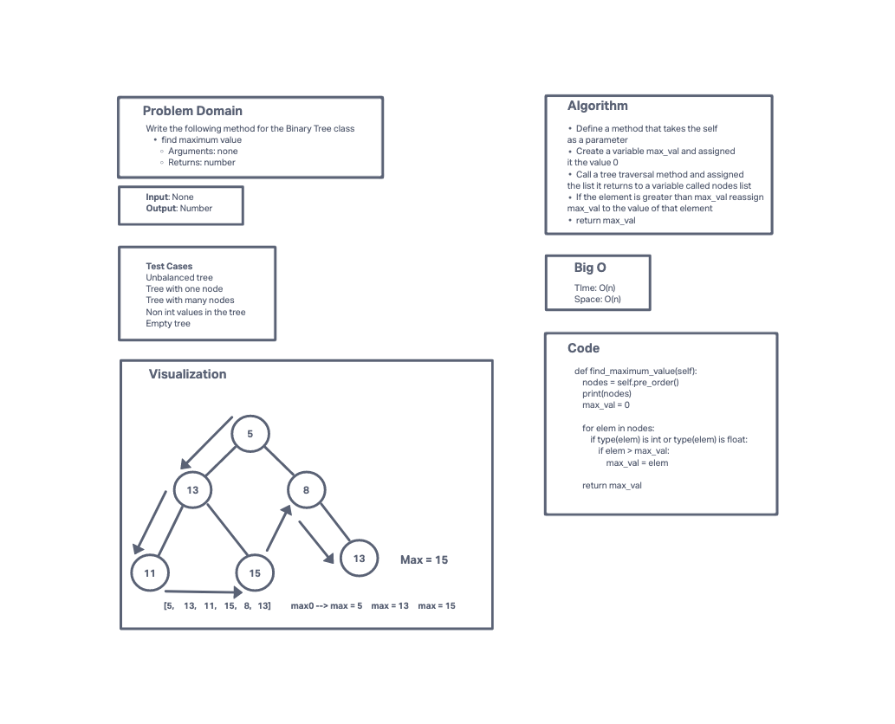

# Challenge Summary
<!-- Description of the challenge -->
Create a method called find maximum value for the Binary Tree Class.
The method should take in no arguments and should return the maximum value stored in the tree.
You can assume that the values stored in the Binary Tree will be numeric.
## Whiteboard Process
<!-- Embedded whiteboard image -->

## Approach & Efficiency
<!-- What approach did you take? Why? What is the Big O space/time for this approach? -->
I called the tree my pre_order tree traversal method and assigned the list returned to a variable called nodes. I then created a variable called max_val and assigned it the int zero. I then looped through every element in my nodes list and reassigned the max_val to the element, whenever the element was greater than max_val. I then returned the max_val once the for loop ended.

