## Insertion Sort in Python
## Author: Domaine Scully

Insertion sort is a fairly simple sorting algorithm that can be implemented in just a few lines of code. With a time
complexity of O(n^2), it is not efficient for large arrays. However, it can be used for small sorting problems,
where it often outperforms other O(n^2) algorithms in practice [[Source]](https://en.wikipedia.org/wiki/Insertion_sort).  This may be because nearly sorted lists can be
quickly sorted with insertion sort.

It’s also a neat little algorithm – deceptively short, but it accomplishes a lot! It makes one pass through an array, temporarily storing each element one at a time. It then looks backwards, comparing prior elements to the current one until it finds a value less than the currently stored value. All values ahead of this target value get shifted one place to the right. The stored value gets inserted in its proper place, one spot ahead of the target. And the algorithm marches on.

If that sounds confusing, just take a look at the following code and example. Here is insertion sort in Python (note
that in Python, arrays are called lists):

```
def insertion_sort(lst):

    for i in range(1, len(lst)):
        j = i - 1
        temp = lst[i]

        while j >= 0 and temp < lst[j]:
            lst[j + 1] = lst[j]
            j = j - 1

        lst[j + 1] = temp

    return lst
```

### Code Explanation

Declare a function that accepts a Python list of numbers to be sorted, stored in the variable lst. Next, make one pass through the list of numbers using a for loop. The variable i keeps track of the current index while iterating over the list. Notice that the for loop starts at position 1, not position 0 (arrays/lists typically have their first index at 0). This is because the algorithm must always compare the current value with previous values.

Every time the index i is updated by the for loop, the current value at index i gets stored in a variable called temp. A second index, j, is defined to keep track of the values that will be compared to the value currently stored in temp. Notice that j is always initialized to start one place behind (to the left of) the current index i.

Next, use a while loop to look one at a time at the values to the left of i, until a value is reached which is smaller than the current temp value. The while loop is controlled by the second index, j, which starts one place to the left of i, and continues to move left (one element at a time) until it either reaches the first index 0, or until the value at j is smaller than the value at i, which is stored in temp.

One more detail to notice – each time before the index j is updated (j = j – 1), the list element currently at position j first gets copied to position j + 1. Why? This has the effect of shifting each element over one place to the right, so that when a value is found that is less than temp, rather than again shifting the current j value one place to the right, there is an open spot for the current temp value to be inserted (hence the name “insertion sort”). This is also why the value at i needed to first be stored in temp. The i value gets overwritten the first time that the j value is moved one place to the right. Subsequent rightward shifts don’t destroy any additional data, since a duplicate entry exists at both positions j and j + 1. And that’s why when the value at j is smaller than the temp value, temp can simply be inserted at position j + 1, overwriting the duplicate entry in that spot while placing the temp value as far left as it can go.

Note that if a value is already correctly sorted (i.e., the value to its left is smaller), the while loop does not run, no shifting happens, and the for loop simply increments the index i and stores a new value in temp.

After one pass through the list, it is sorted in place in ascending order. The time complexity is not linear though,
due to the backtracking performed in the while loop by index j. In the worst case scenario, a list in descending order, j needs to iterate over every element to the left of the current value at i. This is why insertion sort is an O(n^2) algorithm.

### Example

That’s a mouthful for fewer than 10 lines of code, so let’s see an example.

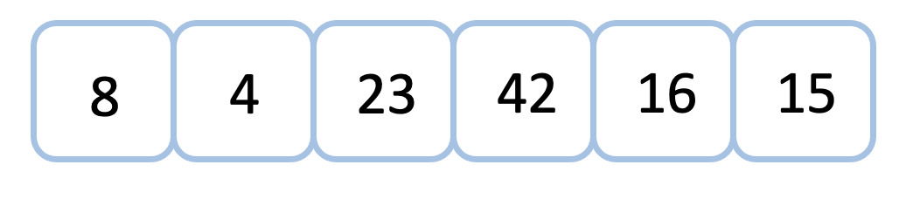

To sort this list, the algorithm initializes a for loop in which the starting index i points to the second element in the list (index 1). The index j is then initialized to point to i minus 1, which is index 0. The value stored at index i is 4 in this case, so this value is stored in the variable temp.

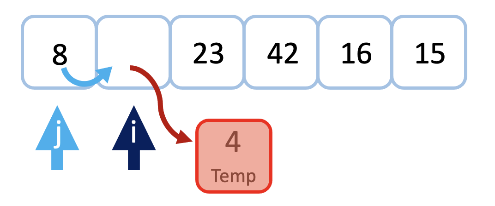

Since the index value j is less than or equal to zero (it’s currently at position zero), and since the temp value of 4 is less than the value currently at index j, which is 8, the conditions of the while loop are met, and the while loop will run.

The value of 8 gets copied to the j + 1 spot, and the index of j gets decremented by 1. The variable j is now set to -1, so the conditions of the while loop no longer hold, and the while loop does not run a second time. Since the while loop has finished, the value temp gets assigned to the location at index j + 1.

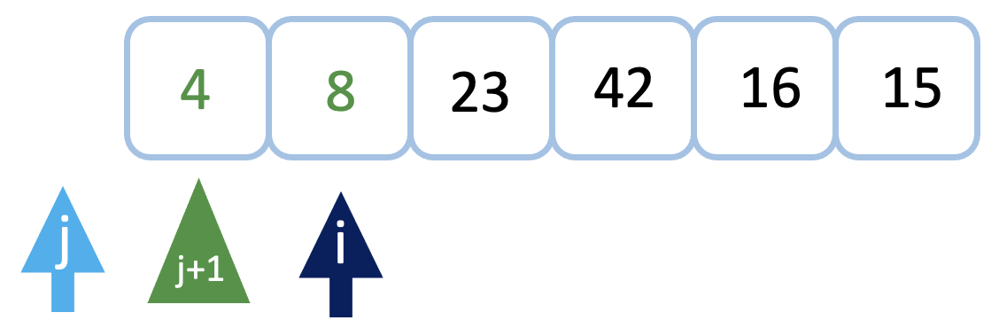

Next, the for loop increments the value of i by one, and the value there is stored in the variable temp.

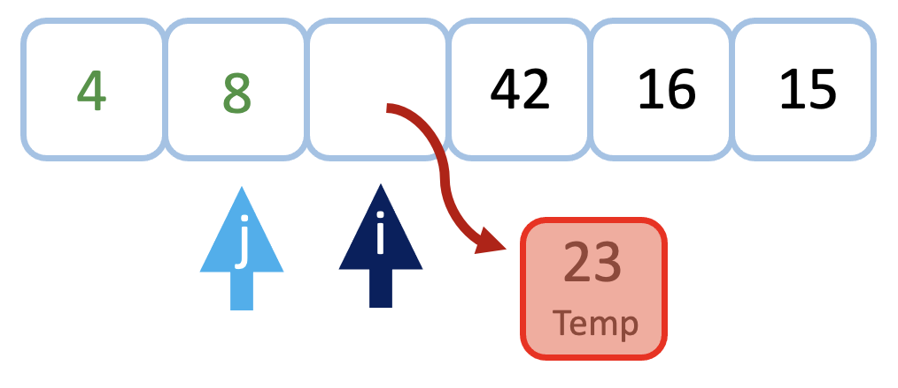

Since the temp value of 23 is greater than the value of 8 at index j, the while loop does not run. The value of temp is then assigned to the location at index j+1, which in this case is still at index i. So the state of the list does not change, and the for loop simply repeats and increments the index i.

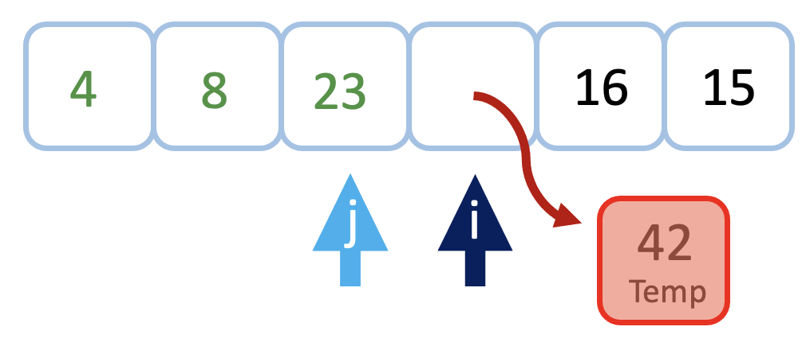

Here again, the value at i is greater than the value at j, so nothing needs to be moved. The while loop does not run, and the temp value is simply assigned again to index j + 1, which is equivalent in this case to index i. Then the for loop increments the index i.

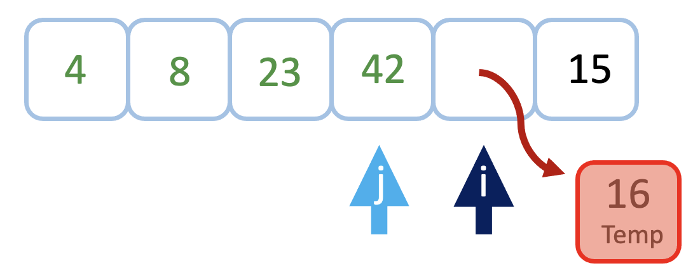

This time the temp value of 16 is smaller than its next two neighbors. The while loop will run twice in this case. Each time, the value at j will be copied over to the location at index j + 1. The while loop stops when the index j points to the value 8, since this is smaller than the temp value 16. The temp value of 16 is then assigned to index j + 1, overwriting the 23. Remember, this is okay because the value of 23 was moved to the right during the execution of the while loop.

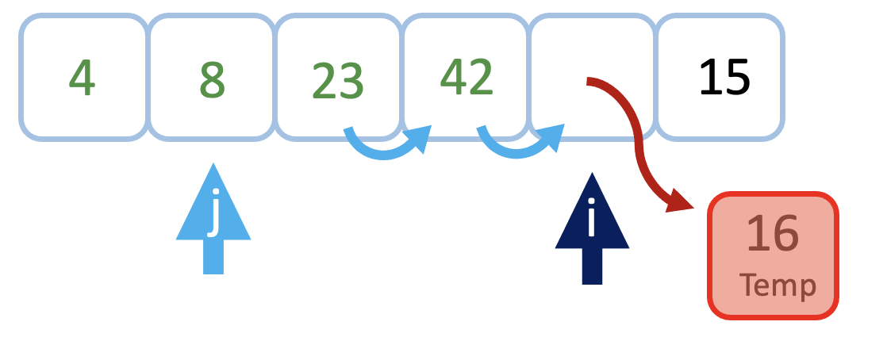

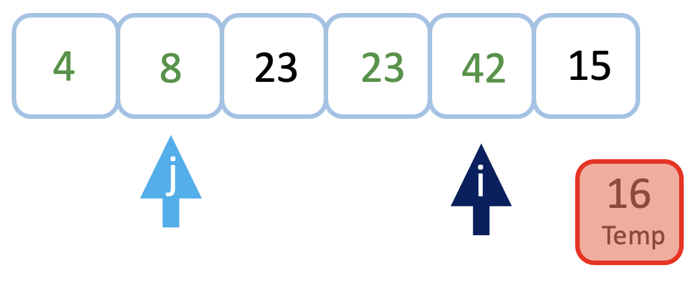

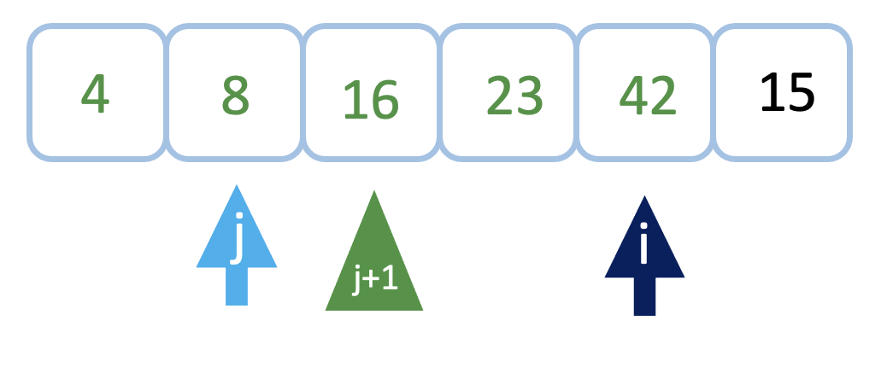

The for loop increments i one last time to reach the end of the list. The index j is initialized to i minus 1, and the
value at i is stored in temp.

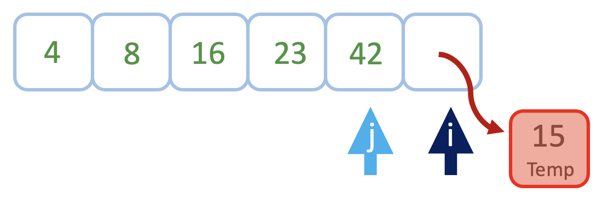

This time the while loop executes three times, each time copying the current value to the location to its right. The while loop stops when j reaches value 8. The algorithm inserts the temp value of 15 at location j + 1. The algorithm is complete and the list is sorted!

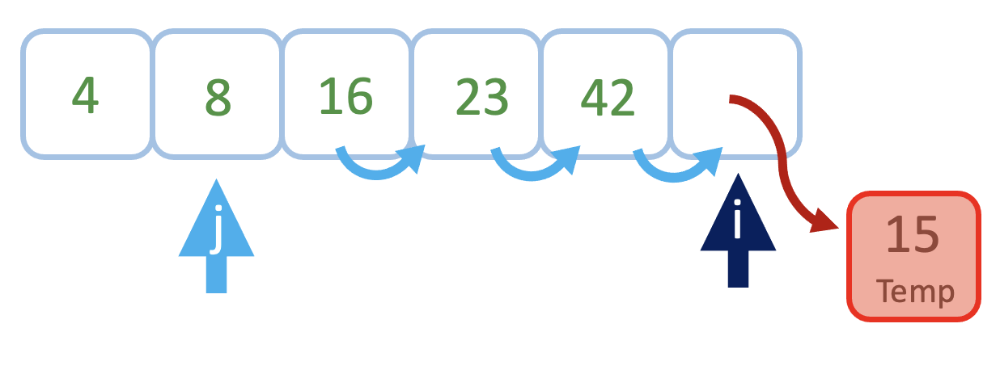

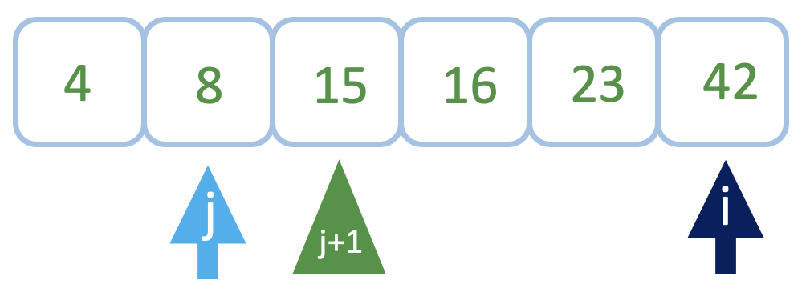

