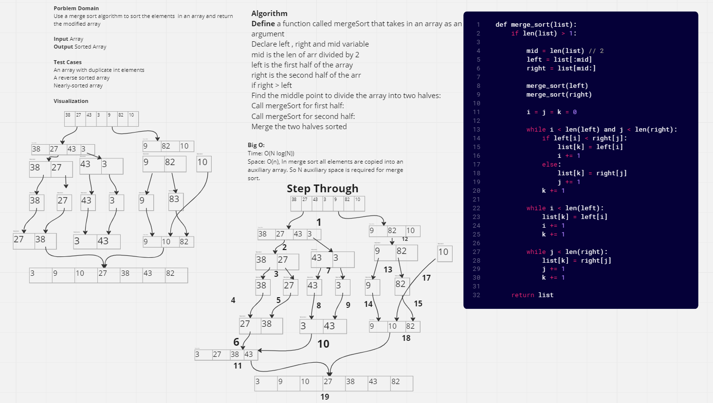

# Challenge Summary

Use a merge sort algorithm to sort the elements in an array and return the modified array.

## Whiteboard Process

## Approach & Efficiency

The approach I took was dividing the array into smaller subarrays, sorting each subarray, and then merging the sorted subarrays back together to form the final sorted array.

Big O:
Time: O(n log n) since this is a recursive sorting algorithm
Space Complexity: O(n) since in merge sort all elements are copied into an auxiliary array. So N auxiliary space is required for merge sort.

## Solution

[Link to Code](merge.py)

[Link to Tests](test_merge.py)
